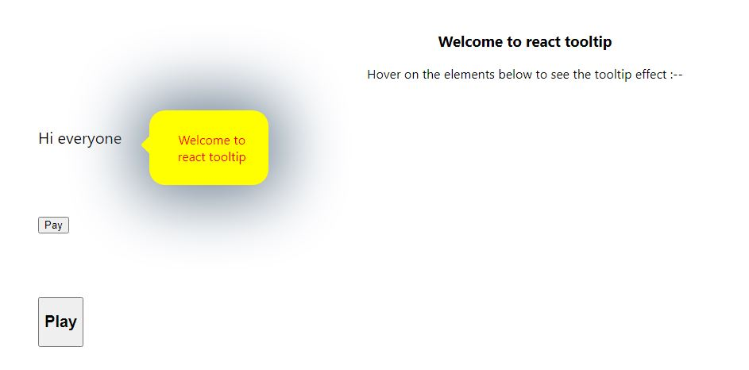

## Tooltip Component

The Tooltip component provides a simple and customizable way to add tooltips to elements in your React application. Tooltips are small, informative messages that appear when users hover over an element, providing additional context or guidance.

### `Hoisted Link`

https://react-tooltip-five.vercel.app/

## Demo

[Watch the tutorial on YouTube](https://www.youtube.com/watch?v=H0d2ZD4e164&feature=youtu.be)

### Features:

- **Customizable Content**: The Tooltip component allows you to specify the content of the tooltip using the `message` prop. You can customize the message to provide relevant information to users.

- **Styling Options**: Customize the appearance of the tooltip using the `color` and `bgcolor` props to set the text color and background color, respectively.

- **Positioning**: Control the position of the tooltip relative to the element using the `left` and `top` props. This allows you to place the tooltip precisely where it's needed on the screen.

### Props:

- `message`: The text content of the tooltip.
- `color`: The color of the text in the tooltip.
- `bgcolor`: The background color of the tooltip.
- `left`: The horizontal position of the tooltip relative to the element.
- `top`: The vertical position of the tooltip relative to the element.

